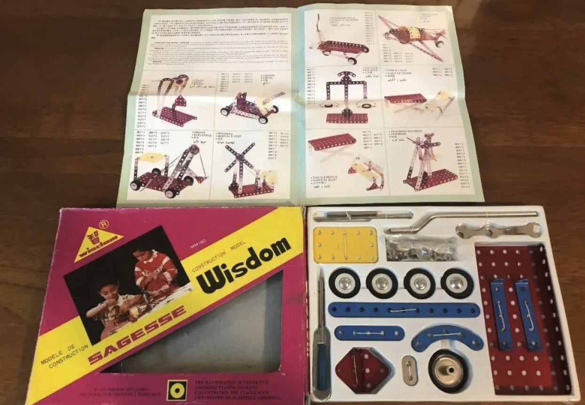

# open-source-overlander 开源穿越房车

注意：本项目有相当大的概率烂尾，请谨慎参与 :):):)

# 写在前面：没有完美的房车

每个房车都有自己的特定应用场景。Class A适合退休老夫妇，候鸟生活，后面拖一个Jeep牧马人，每个营地至少住几个月。Class C兼顾了居住和行动能力，但显然两边都有所欠缺。CLass B在疫情期间超级流行，但空间明显局促。背驼一般用4驱卡车背，行动能力明显优于其他几种，但毕竟房子太沉，就别琢磨真正的越野了。车顶帐篷几乎不影响行动能力，但风大的时候就很悲剧，并且一般生活设施几乎等于零。穿越房车行动能力好，但做饭洗澡只能在车外，有时候还是不太方便。

以前我有一个Class C，带着我们走遍了美国49个州外加加拿大的很多地方，如果我再有机会做full timer，我应该还会选他。

# 需求分析

| 需求 | 对应功能 |
| --- | ----------- |
| 周末或者短途旅行 | 多数情况在移动中，不会长时间居住在一个地方，居住要求较少。 |
| 攀岩，但不滑雪 | 温度适中，对暖气、空调基本没需求。不会太潮湿。|
| 可能去Baja下沙滩，去Yukon，但不去Moab爬石头 | 重量要轻，但不需要严格限制宽度。|
| 可能走一些简单穿越线路，比如Death Valley，Canyonland NP之类| 只要没虫子就尽量享受户外|
| 想不好| 所以最好车内空空的可以任意折腾｜

# 可能的选择

## [Four WHeel Camper的Project M](https://fourwheelcampers.com/model/project-m/)

FWC是一家50年历史的老店，和Lance等大型背驼房车而言，他主打软升顶越野房车。Project M是一个很好的坯子，除了一个讨厌的板凳，几乎是完美的车型了。
但是，他那个板凳是结构件，不能拆除。板凳产生的原因是Project M和其他滑入式房车一样宽，为了这个结构，只好做了个板凳了。

## [Hiatus Camper](https://www.hiatuscampers.com/)

开创性的硬侧壁，和软侧壁相比，基本没有未来的维护成本了。
初创企业，网上视频很少，产能非常有限，订货至少也是2024了。
去他的购买页面尝试下个单，发现简单配一下就21K了，一个空壳？有点虚高了。

## [麦卡房车](http://rvback.com/)

国内厂商，看着产品不错，开始同意按照我的需求定制，后来实际要下单了说老板不做北美市场。稍微查了一下，发现早期拿下了FWC中国代理，后期到底是直接山寨还是有协议就不得而知了。怪不得内饰啥的看着和FWC神似呢。

## [Kit Camper](https://www.kitcampers.co/diypopupv2)

很久之前刷到过，看起来超级简陋，直接略过。等被上面两个房车伤心之后，重新来看发现他有一个其他任何房车不可比拟的优势：直接用的就是80/20铝合金，等于框架和轨道都是Organic的，后期任何的增删改查，直接搞就行了，绝对不会伤筋动骨。看一下Project M，就在两侧装上两条80/20就要$750。

## 对比分析

| 厂商 | 喜欢 | 不喜欢 |
| --- | --- | --- |
| FWC Project M | 50年大厂，可靠。空间大。| 唯一的缺点：车内Wing不能拆，严重影响内部装沙发之类的 |
| Hiatus | 侧壁是硬的，超喜欢| 小厂没经过时间考验质量存疑，比Project M还贵很多 |
| 麦卡房车| FWC模仿秀，本来说可以任意按照需求定制，结果临门一脚说不能做北美市场。| 人家不喜欢我 |
| Kit Camper| 全部80/20铝合金打造，后期可以随意修改 | 纯粹低成本考量，DIY经验有限 |

## 完美目标
 Kit Camper的80/20铝合金 + Hiatus的硬升顶。
 
 反思想折腾的另外一个重要原因就是：特别羡慕小朋友家的建造模型，但只能是去人家的时候才能玩。这次总算能自己玩一票了。。。
 

