# 目标

希望用碳纤维泡沫夹芯板(Carbon Fiber XPS foam sandwich board)做一个Truck Popup的车顶，重量轻，强度大。

# 实验1: 1" XPS Foam Board + 单层碳纤维
## 原材料

### XPS发泡板：[1" XPS Foam Board](https://www.homedepot.com/p/Owens-Corning-FOAMULAR-NGX-1-in-x-2-ft-x-2-ft-R-5-Project-Panel-XPS-Rigid-Foam-Board-Insulation-9WE/315401957)

[产品参数](https://dcpd6wotaa0mb.cloudfront.net/mdms/dms/EIS/58307/FOAMULAR-and-FOAMULAR-NGX-600-400-1000-XPS-Product-Data-Sheet.pdf?v=1666616994000)

实验中使用的是XPS Formula-150型号，也就是15psi的型号。HD能买到的1"是15 psi, 2"是25 psi，没有40/60/100 psi型号。

### 碳纤维布：[Carbon Fiber Sheet 2x2 Twill Weave-3K/220g](https://www.amazon.com/dp/B0BXLJTYGN?psc=1&ref=ppx_yo2ov_dt_b_product_details)

最流行的就是这种2x2 3K/220g的

2x2 是编织方法，经纬线编织，可以双向受力，适用于平面。其他特殊编织方法可以做出更好的造型，但会牺牲其他方向的强度。

3K是单股碳纤维数量。淘宝12K多是建筑物加固的，一般是单向受力。

220g是单位面积重量。

### 环氧树脂：[Glaze Coat Clear Epoxy Kit](https://www.homedepot.com/p/FAMOWOOD-1-qt-Glaze-Coat-Clear-Epoxy-Kit-5050080/301826159)

这是原来用来做桌面的环氧树脂，透明度好，室内使用，不防UV。

以后真正做需要使用船用的树脂，防UV。

## 试验过程

### 夹芯板制作

XPS板长13", 宽6.5"

环境温度70F+混合环氧树脂A/B配方，搅拌6分钟，涂XPS板上，铺碳纤维布，再涂一层树脂，用刮板刮平。

放24小时之后，换面，给另外一面家碳纤维。

### 强度测试

两头架空，人踩在中间，板子变形。

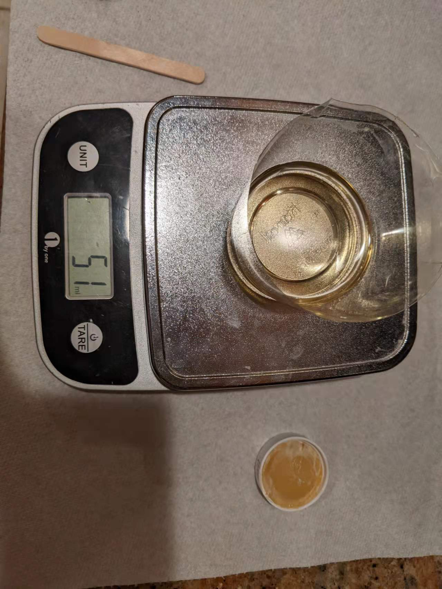

环氧树脂准备中

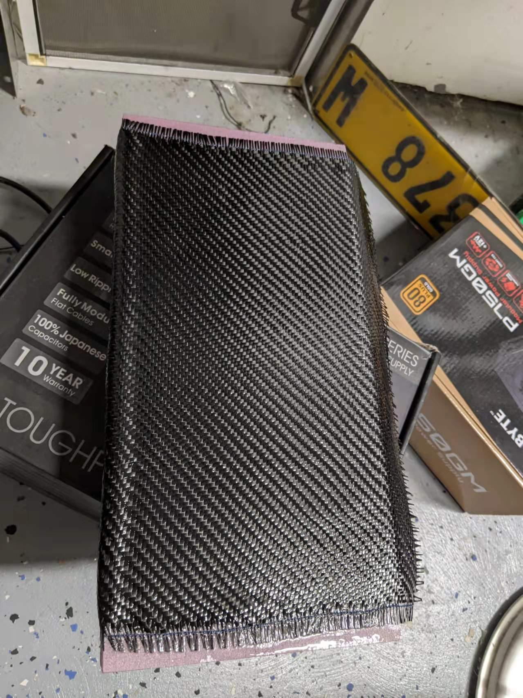

单面碳纤维粘贴。可以看到左侧转角有明显的隆起，贴合不严密

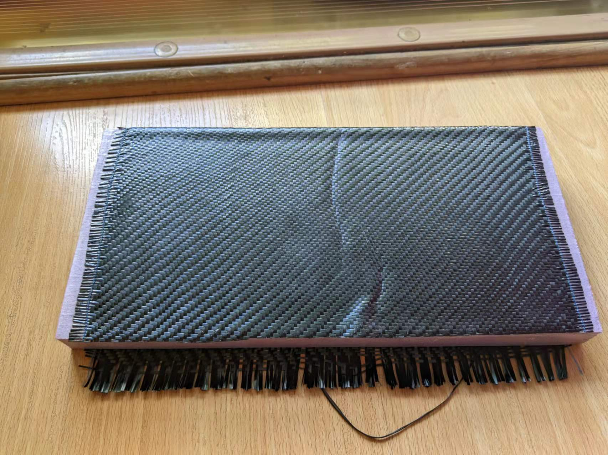

做过强度测试之后的夹芯板，可以看到中间明显的折痕

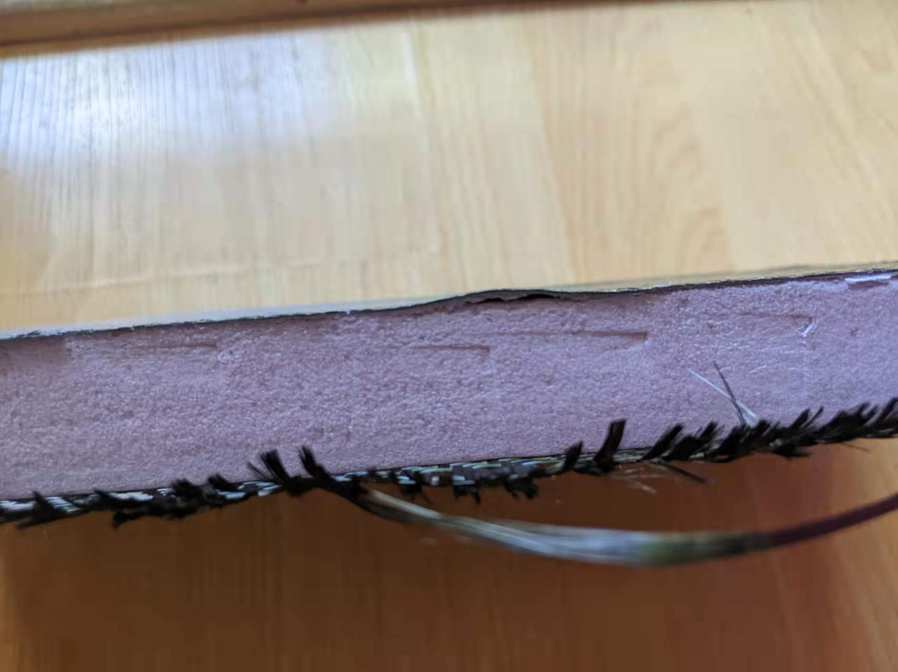

凑近看一下，折痕附近已经脱离

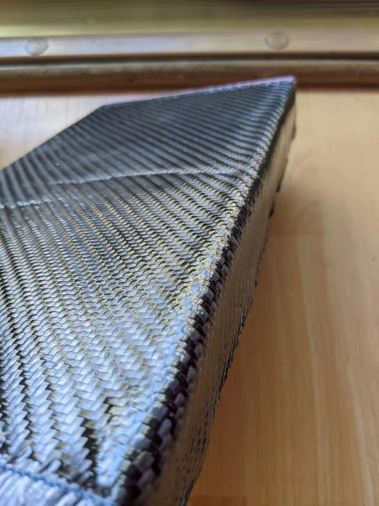

换个角度看折痕

再另外一块板子上测试：切一个小弧度出来，碳纤维布就可以比较好的贴合了。

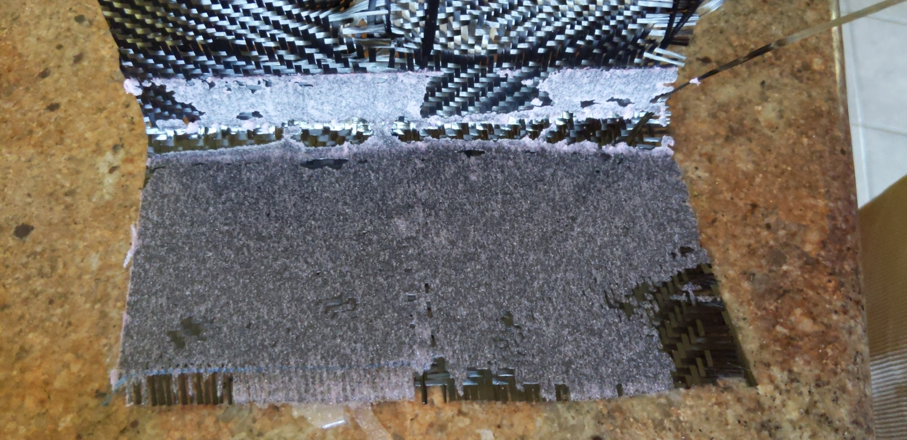

把上面的那块碳纤维撕下来，当时转角没有涂好树脂，凑合的。转角也是拿工具刀随便割的，切面非常不平整。下次可以单独找一个小板子测试这个项目。

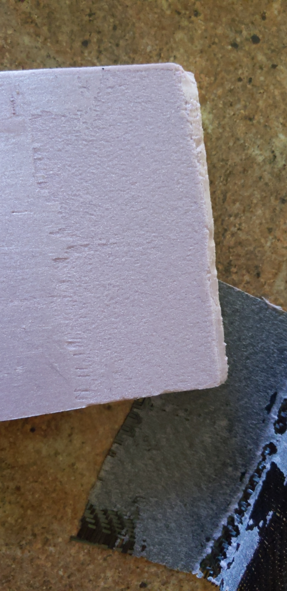

撕掉碳纤维之后的泡沫板

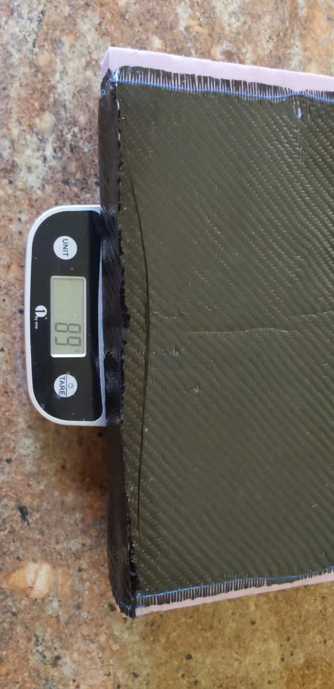

6.5" x 13" 重量 89g，那么67" x 120"的重量大约是 9173g = 20lbs

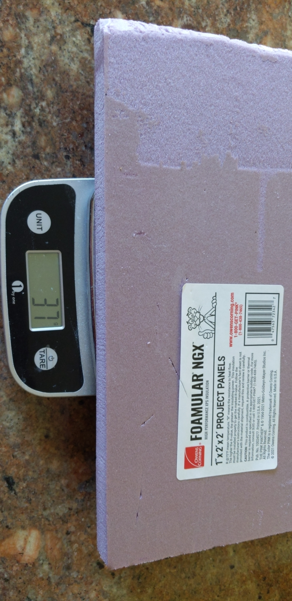

同等尺寸的XPS foam重量 37g。现在用的是1"的板子，如果厚度增加到2"，那么整个车顶的重量也不会超过30lbs。

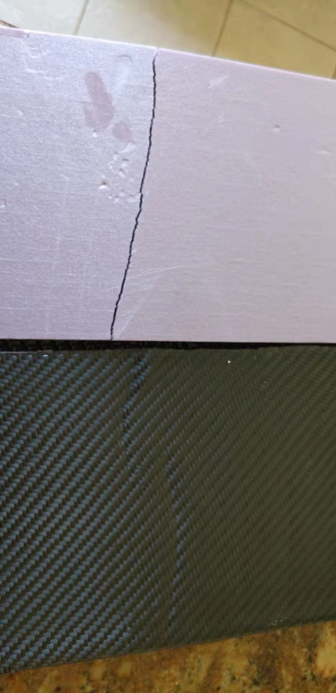

没有碳纤维的板子轻松踩断，有碳纤维的板子只是留下了折痕。撕掉碳纤维之后，板芯也没有断裂，表面也没有明显折痕。

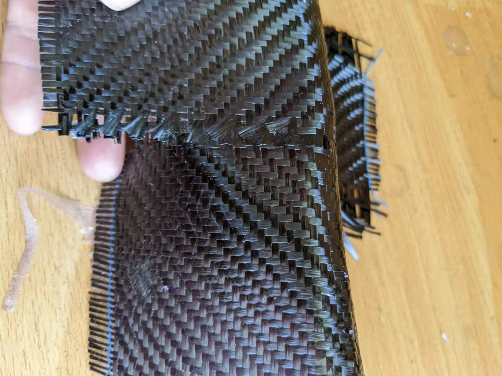

测试两块碳纤维的连接，中间只用了非常窄的重叠。侧向用力可以撕开，但没有办法横向拉开。强度足够。

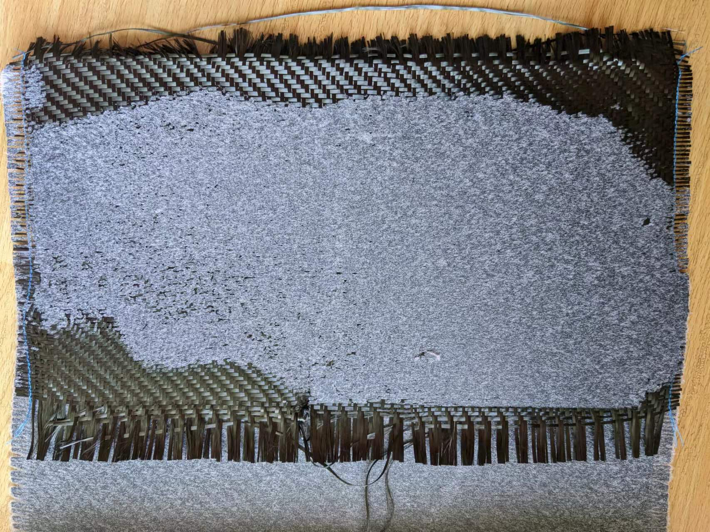

把碳纤维从测试板上撕下来，可以看到四周并没有树脂的痕迹。其实这是第二面的碳纤维，当时追求技术进步，树脂涂得比较少，但确认每个地方都涂到了。感觉应该是树脂和碳纤维浸润性更好，所以树脂比较薄的地方，碳纤维的经纬线自己粘合在了一起，但和发泡板就没有有效粘合了。以后可以适当尽量多用树脂，不要追求极致轻量化。

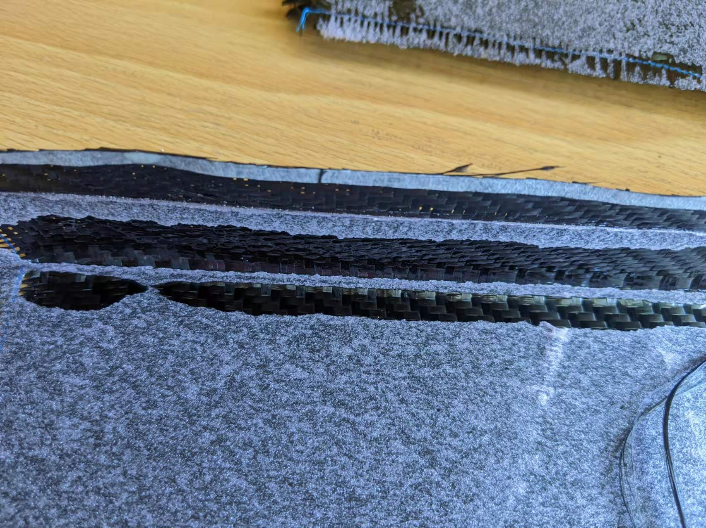

直角碳纤维撕下之后的效果，树脂很多，没有办法紧密连接。或者用圆角，或者要用其他东西压住，形成类似真空袋的效果才可以。

## 问题分析

### 强度小是因为XPS PSI不够吗？

夹芯板被明显踩弯，碳纤维有明显的折痕，松开后板子基本上又恢复原状了。

感觉是XPS板子不够硬？表面被踩变形之后，整个板子的强度被破坏了。

可以通过选用更高PSI的板子或者增加碳纤维的层数来加强？

### 多大强度才足够用？

测试中6.5"承受了125lbs的压力，如果整车宽度65"，那么就等于1250lbs的压力，如果只是需要一个超轻的车顶，需要多大的强度就足够了？

### 碳纤维的边缘问题

板子的双面都容易做，但如果直接做整个车顶，不用其他框架，边缘很难处理。

实验中的边缘因为碳纤维有一定的刚性，不会特别贴合，这个应该会极大降低强度。

抽真空的方式制作夹芯板应该可以解决这个问题，但尺寸太大了，只能用最简陋的方式制作。

### 将来的固定点问题

如果用夹芯板直接做车顶，那么就有各种硬件的连接问题，现在想到的是可以用3M VHB双面胶粘贴，但总觉得心里不太踏实。

如果用铆钉之类的连接，那么碳纤维这边应该如何处理？并且这些金属件会有电偶腐蚀（Galvanic Corrosion）问题

# 实验2：1” XPS Board + 双层碳纤维

多刷了一层碳纤维，已经可以轻松承受我的重量了，强度足够了

测试样品：6.5" x 13"，压力125lbs，车子宽度68"，所以可以承受 1250lbs"，车子长度120"，具体能承受多少力不会算了。

车顶本来也没准备占人，除了天窗，太阳能板，这个肯定都不是问题。

如果放行李架，可以能需要单独计算。

6.5" x 13" 重量 165g，那么67" x 120"的重量大约是 15.7kgkg = 34lbs，同样是轻如鸿毛

车顶面积：3.08 * 1.78 * 2面 * 2层= 22平米

# 实验3 Nomex + 双层碳纤维

## 杜邦公司3/8 Nomen Honeycomb Core

Nomex® honeycomb 是由 Nomex® 芳纶纤维纸制成的复合芯材。其广泛用于航空航天、建筑、军事、海洋、体育和汽车工业的众多工程和科学应用，由于其耐热性、轻质强度和耐用性，是广泛使用的理想材料。

https://www.dupont.cn/nomex/what-is-nomex.html

都是用在高档货上的，价格贵。1" x 4' x 8' = $800，比XPS贵了15倍左右。

1/8 cell size, 3.0 lbs/ft3 density

试验板芯重量：3 * 6.5/12 * 13/12 * 3/8/12 = 0.055 lbs = 24g 

碳纤维重量：6.5" x 13" x 4 layer = 338 sq in = 0.218 sq meter = 48g

Epoxy重量：1:1碳纤维重量 = 48g 

总重量：48 + 48 + 24 = 120g

## 实验结果

实验结果：完全可以承受一个人的重量。

对比测试：实验同时做了两组，一组是整块的Core，一组是两块Core拼接，效果没差别。

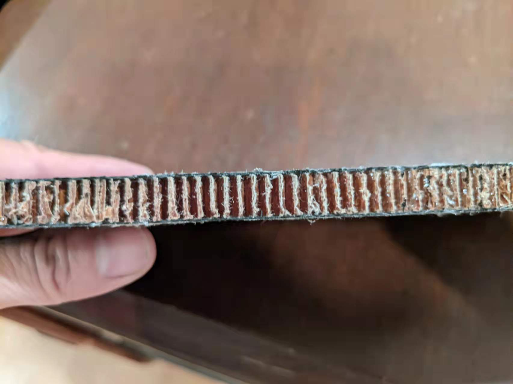

厚度非常薄，但强度足够大。

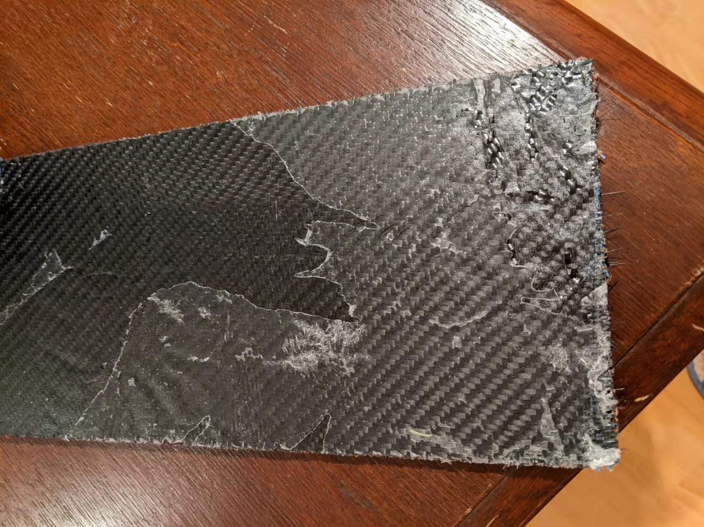

忽略板面的皱纹和赖疤，是用一块包肉的蜡纸做的基板，然后压了一个大铁球。

教训：用圆锯切割的板边效果非常差，应该用角磨机。

# 材料分析

## 双层碳纤维重量

车顶尺寸： 70" x 128"

Nomex Core: 1/8 cell size, 3.0 lbs/ft3 density
Total Core Weight: 70/12 * 128/12 * 1/12 * 3 = 15.55 lbs = 7.06kg

Carbon Fiber Weight: 70" * 128" = 8960 sqin = 5.78 sqaure meters, x 4 = 23.1 sq meters x 220g = 5.08 kg
Epoxy Resin = Carbon Fiber Weight * 1.2 = 6kg
Skin Materials Weight: 11.08kg

XPS 150 1.2lbs/ft3, 400 2lbs/ft3, 600 2.4lbs/ft3
Core Weight: 70/12 * 128/12 * 2/12 * 2.4 = 24.89 lbs = 11.28kg

Total Roof Weight: 11.08 + 11.28 = 22.36kg = 49.29 lbs

https://commercial.owenscorning.com/uploadedFiles/foam/products/Commercial%20Property%20Directory%20of%20Physical%20Properties.pdf

For hand Layups, the fiber / resin ratio is usually ~50% at best. For exact science, one would say 207 grams of fiber is the same as 207 grams of mixed resin. But if you are estimating, it is
better to use a higher figure to ensure there is enough resin for a job. The ratio is always going to be proportional to this ratio.

https://compositeenvisions.com/document/resin-to-fiber-ratio-explained/
