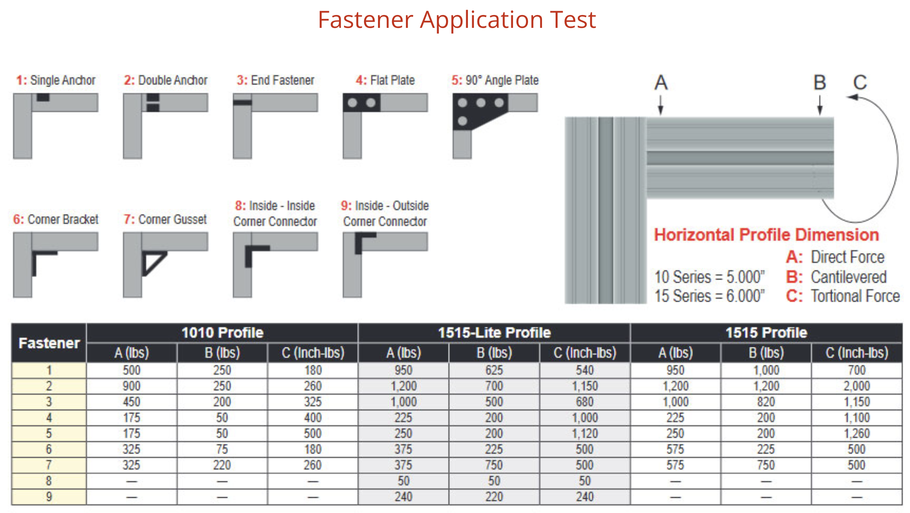

# 整体结构
## 防水
kit camper车顶架构：多块板材拼接，ACM直接粘80/20

问题：因为不是焊接，所以接缝地方可能会漏水？
问题：slot前后通透很烦，只能加盖？

## 保温
问题：没想好到底是2"保温，1"保温，还是0"。多数情况0"足够了，但万一走北极公路呢？

## 结构
问题：受力分析
问题：螺丝太多容易松动，Lockrite?

### 80/20强度

https://www.rmmc.net/8020/technical-data/#:~:text=80%2F20's%206105%2DT5*,%2C%20steel%2C%20copper%20or%20brass.

从图表看，结构需要加强。

### 3M VHB真的可以替代铆钉？
https://multimedia.3m.com/mws/media/764998O/iatd-product-info.pdf

## 板材
### ACP/ACM (Aluminum Composite Panel/Material)铝塑板
Kit Camp: 3mm Aluminum Composite Panel
优点：强度好直接可以做外墙，施工简单。
缺点：重，不保温

### 自制三明治
1/2木板+1"泡沫板+0.050"铝板，Loctite PL Premium
https://www.youtube.com/watch?v=FhsTJpMADJE&list=PLMCvRxq4QdccLFEd53JSsRaGNk18nGeMF&index=4
优点：保温，轻
缺点：制作复杂，需要框架才能用

问题：可以直接铝+XPS当车顶，不用框架吗？

# 箱体

## 箱体结构
### 方案选择
最佳方案是直上直下，和车身平齐，取车内空间和外部尺寸的折衷。

不采用Project M的宽出车身的结构，太笨拙。

不采用Hitus的梯形结构，车内空间太小。

### 当前方案BOM：
1" x 3" 固定轨道 x 2

2" x 2" 立柱 x 4

1" x 1" 底部横向连接

2" x 2" 顶部横向连接

### 问题讨论
问题1：车身连接当前用的是1x3，但是车帮Rail宽度比较宽，改用2x4是否更好？同时可以增宽一点车内空间。

问题2：Clamp强度是否够用？Project M用的是bolt解决方案

问题3：需要拆掉车帮的塑料板找平？

问题4: 是否要增加更多支撑

### 参考链接

[FORD F-150 CAB HEIGHT BED RACK](https://cbioffroadfab.com/product/ford-f-150-cab-height-bed-rack-6-5-bed-2004-2020/)
[安装车厢盖，参考其中的防水处理](https://www.youtube.com/watch?v=i6Q86sAC4UQ)

## 尾门
问题：原车尾门比较宽。当前方案是尽量后移，让箱体遮挡住尾门的远端，但防尘又是问题，并且立柱等于是悬空了。有可能买一个Leer shell的防尘罩子？

## 箱体上部

# 升顶机构

https://www.douyin.com/video/7121094599694748959

问题：硬升顶结构照抄Hiatus?

问题：升顶过程中的稳定性？

问题：撑杆可以放在前后还是侧面的差别？侧面可能容易被数刮

# 车顶

Kit方案：直接ACM板材+VHB粘贴

问题：材料？ACM很重，似乎可以借鉴DIY XPS + Aluminum Sandwich?

问题：车顶结构

问题：防水

问题：板材和框架固定

问题：如何能搞定整块大板？减轻防水压力

# 卡车准备
防尘：https://bedrug.com/bedrug-impact-bedliner/2021/ford/f-150

还需要尾门Seal
